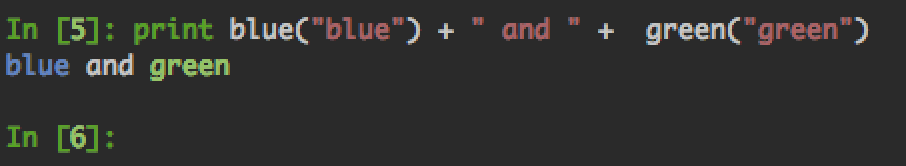

.. this-package documentation master file, created by
   sphinx-quickstart on Thu May 14 16:58:55 2020.
   You can adapt this file completely to your liking, but it should at least
   contain the root `toctree` directive.

k3color
==========

.. automodule:: k3color

This snippet will output colored text on a terminal::

   from k3color import blue
   from k3color import green
   blue("blue") + " and " + green("green")

.. toctree::
   :maxdepth: 2
   :caption: Contents:

.. contents::
   :depth: 4
   :local:

Working with prompt
**************************

To use colored string with terminal prompt,
the terminal prompt is not wrapping correctly with very long commands.
You need `prompt=true` to tell `Str` to fix these issues::

   prompt = Str('colored prompt# ', color='red', prompt=True)

Those screenshots show this issue, the cursor is box.

`prompt=False` long command:

.. image:: res/colored-false-prompt.png

`prompt=False` long command after **Home Key**:

.. image:: res/colored-false-prompt-home-key.png

`prompt=False` long command after **End Key**:

.. image:: res/colored-false-prompt-end-key.png

`prompt=True` long command:

.. image:: res/colored-true-prompt.png

`prompt=True` long command after **Home Key**:

.. image:: res/colored-true-prompt-home-key.png

`prompt=True` long command after **End Key**:

.. image:: res/colored-true-prompt-end-key.png

Classes
----------

.. autoclass::  Str

Functions
---------

.. autofunction::  fading_color
.. autofunction::  percentage

Indices and tables
==================

* :ref:`genindex`
* :ref:`modindex`
* :ref:`search`
